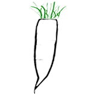

  

  &nbsp;
  

<!-- 

  

 -->

## About Me

I'm a software and machine learning engineer at Texas A&M AgriLife Research, working alongside structural biologists, medicinal chemists, and computational scientists on early-stage drug discovery. Much of my work supports the TB Drug Accelerator (TBDA), a Gates Foundation consortium that brings together pharmaceutical companies, universities, and research institutions.

📍 Austin, TX &nbsp;·&nbsp; M.S. CS, Texas A&M

---

## Selected Publications

| Year | Paper | Journal |
|:----:|:------|:------|
| 2026 | [CAGE Fusion: Deep Learning for Nuisance Compound Detection Using a Gated Co-Attention Graph Embedding Model](https://link.springer.com/article/10.1186/s13321-026-01207-4) | [Journal of Cheminformatics, *Springer Nature*](https://link.springer.com/journal/13321) |
| 2025 | [Integrating Chemical, Genetic, and Feasibility Assessments for Anti-Tubercular Target Validation](https://link.springer.com/article/10.1038/s44321-026-00415-7) | [EMBO Molecular Medicine, *Springer Nature*](https://link.springer.com/journal/44321) |
| 2023 | [DAIKON: A Data Acquisition, Integration, and Knowledge Capture Web App for Target-Based Drug Discovery](https://pmc.ncbi.nlm.nih.gov/articles/PMC10353056/) | [ACS Pharmacology & Translational Science, *American Chemical Society*](https://pubs.acs.org/journal/aptsfn) |

---

## Production Applications

Applications I lead or have led from architecture and development through production deployment, supporting drug discovery teams across academic, nonprofit, and pharmaceutical organizations.

<table>
  <tr>
    <td width="68" align="center" valign="middle"></td>
    <td valign="top">
      <b>DocuStore</b> &nbsp;·&nbsp; <a href="https://docustore.io">docustore.io</a> · <a href="https://github.com/sidxz/docu-store">GitHub</a> 
      A chemistry-aware, domain-constrained RAG and document intelligence platform for drug discovery. DocuStore extracts and connects chemical structures, compounds, biological entities, bioactivity measurements, and scientific text to enable evidence-grounded search and question answering across complex research documents.
    </td>
  </tr>
  <tr>
    <td width="68" align="center" valign="middle"></td>
    <td valign="top">
      <b>CAGE-Fusion</b> &nbsp;·&nbsp; <a href="https://doi.org/10.1186/s13321-026-01207-4">Paper</a> · <a href="https://github.com/sidxz/cage_fusion">GitHub</a> 
      A deep learning model for molecular property prediction, specialized in identifying nuisance compounds that can confound early-stage drug discovery assays. CAGE-Fusion predicts aggregation, luciferase inhibition, chemical reactivity, and promiscuity using learned molecular representations.
    </td>
  </tr>
  <tr>
    <td width="68" align="center" valign="middle"></td>
    <td valign="top">
      <b>DAIKON AI &amp; Curator Studio</b> &nbsp;·&nbsp; <i>Closed user group testing · Coming soon</i> 
      A collaborative drug discovery platform for scientific data curation, AI/ML prediction, analysis, and project management across the early discovery lifecycle, from genes and targets through screening, hit assessment, portfolio management, and post-portfolio studies. 
      DAIKON AI &amp; Curator Studio is the next generation of <b>DAIKON</b>, extending a platform used by the <a href="https://www.tbdrugaccelerator.org">TB Drug Accelerator</a> consortium since 2022 to support collaborative tuberculosis drug discovery.
    </td>
  </tr>
  <tr>
    <td width="68" align="center" valign="middle"></td>
    <td valign="top">
      <b>ChemCellar</b> &nbsp;·&nbsp; <a href="https://chemcellar.com">chemcellar.com</a> · <a href="https://github.com/sidxz/cellar">GitHub</a> 
      An open-source compound registration, management, and screening platform for research organizations. ChemCellar provides a centralized environment for managing molecules, assays, protocols, compound collections, screening data, and research projects.
    </td>
  </tr>
  <tr>
    <td width="68" align="center" valign="middle"><a href="https://github.com/saclab/daikon-core-server"><picture>
      <source media="(prefers-color-scheme: dark)" srcset="assets/apps/daikon-dark.png"/>
      
    </picture></a></td>
    <td valign="top">
      <b>DAIKON</b> &nbsp;·&nbsp; <a href="https://github.com/saclab/daikon-core-server">GitHub</a> · <a href="https://pmc.ncbi.nlm.nih.gov/articles/PMC10353056/">Paper</a> 
      An open-source framework for collaborative, target-based drug discovery. DAIKON integrates targets, screens, hits, compounds, and project portfolios into a unified system that captures the progression of discovery programs and enables scientific teams to curate, analyze, visualize, and share project data. 
      DAIKON has been used in production within the <a href="https://www.tbdrugaccelerator.org">TB Drug Accelerator (TBDA)</a>, a <a href="https://www.gatesfoundation.org"><b>Gates Foundation</b></a> initiative, since 2022, supporting collaborative drug discovery across academic and pharmaceutical research organizations.
    </td>
  </tr>
</table>

---

## Tech Stack

| | |
|:--|:--|
| **Languages** |     |
| **AI / ML** |         |
| **Backend** |         |
| **Frontend** |     |
| **DevOps & Cloud** |         |
| **Philosophy** |      |

---

<!-- ## Featured Projects

<table>
  <tr>
    <td width="50%" valign="top">
      <h3><a href="https://github.com/saclab/daikon-core-server">DAIKON</a></h3>
      
Open-source end-to-end drug discovery platform. Digital backbone of the TB Drug Accelerator — a Gates Foundation-backed consortium across 30+ global institutions. Architected on CQRS, event sourcing, and microservices.

      
      
      
    </td>
    <td width="50%" valign="top">
      <h3><a href="https://github.com/structflo/structflo-ner">StructFlo NER</a></h3>
      
Zero-config named entity recognition for drug discovery, chemistry, and biological sciences. Transforms unstructured scientific text into structured, machine-readable chemical knowledge.

      
      
    </td>
  </tr>
  <tr>
    <td width="50%" valign="top">
      <h3><a href="https://github.com/saclab/daikon-core-webapp">DAIKON Web App</a></h3>
      
Data-intensive SPA for drug discovery workflows with embedded 2D/3D structural rendering via RDKit (WASM) and LiteMol. Replaced static spreadsheets for a global network of scientists.

      
      
    </td>
    <td width="50%" valign="top">
      <h3><a href="https://github.com/sidxz/parsnip">Parsnip</a></h3>
      
Target tractability assessment platform integrating genetic, chemical, and translational evidence to systematically rank and prioritize TB drug targets.

      
      
    </td>
  </tr>
</table>

--- -->

## GitHub Stats
<!-- 

  
  &nbsp;
  

 -->

  

---

